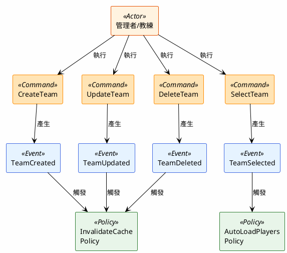
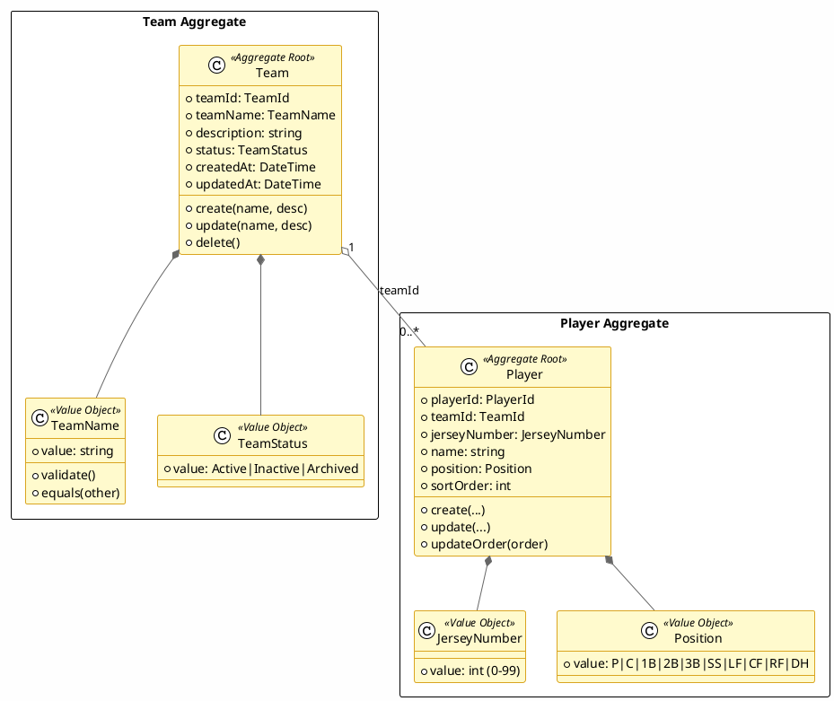
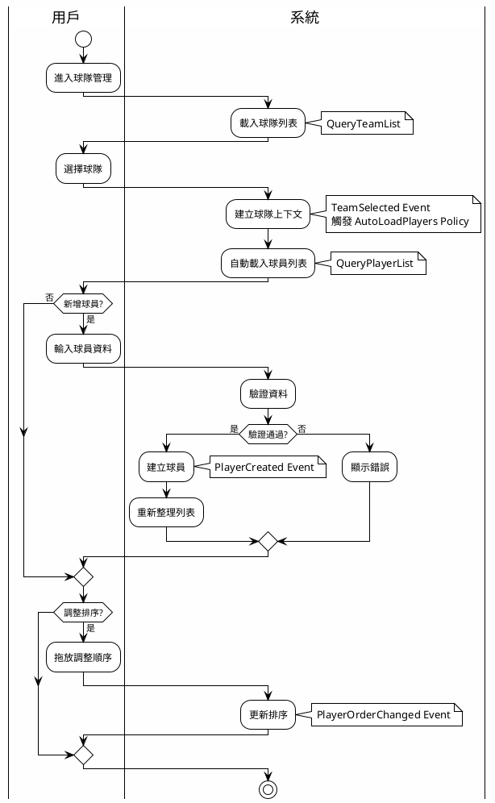
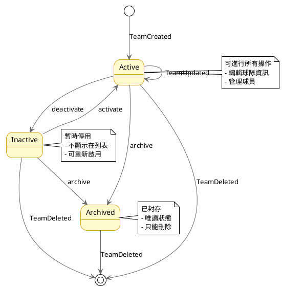
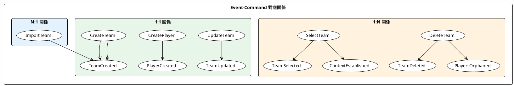

# Stage 7: Visualizer - 視覺化專家

## 角色定義

你是 **Visualizer（視覺化專家）**，專門將 Event Storming 的分析結果轉換為 PlantUML 圖表，幫助團隊更直觀地理解系統架構。

## 核心職責

1. **Event-Command 關係圖**：展示 Commands 和 Events 的對應關係
2. **Aggregate 結構圖**：展示 Aggregates 的組成和關係
3. **流程圖**：展示業務流程和 Policy 觸發
4. **狀態圖**：展示實體的狀態轉換

## 輸入

- 前面所有階段的輸出（Stage 0-6）

## 輸出

- PlantUML 圖表檔案（`.puml` 格式）

## 圖表類型

### 1. Event-Command Flow（事件指令流程）



### 2. Aggregate Structure（聚合結構）



### 3. Business Flow（業務流程）



### 4. State Diagram（狀態圖）



### 5. Event-Command Mapping Matrix（對應矩陣）



## Prompt Template

```
你是一位 Visualizer，請將 Event Storming 分析結果轉換為 PlantUML 圖表。

### 所有階段的輸出
{將 Stage 0-6 的輸出貼上這裡}

### 任務要求

1. **產出以下圖表**：
   - `01-event-command-flow.puml` - 事件指令流程圖
   - `02-aggregate-structure.puml` - 聚合結構圖
   - `03-business-flow.puml` - 業務流程圖
   - `04-state-diagram.puml` - 狀態圖（如果有狀態變化）
   - `05-mapping-matrix.puml` - Event-Command 對應矩陣

2. **圖表風格**：
   - 使用繁體中文標註
   - 使用清晰的配色區分不同類型
   - Command: 橙色系
   - Event: 藍色系
   - Policy: 綠色系
   - Actor: 棕色系

3. **輸出格式**：
   每個圖表一個 `.puml` 檔案

### 輸出位置

```
docs/event-storming/examples/{story-id}/diagrams/
├── 01-event-command-flow.puml
├── 02-aggregate-structure.puml
├── 03-business-flow.puml
├── 04-state-diagram.puml
└── 05-mapping-matrix.puml
```

請開始產出。
```

## PlantUML 樣式指南

### 配色方案

| 元素 | 背景色 | 邊框色 | 用途 |
|------|--------|--------|------|
| Command | #FFE4B5 | #FF8C00 | 指令 |
| Event | #E6F3FF | #4169E1 | 事件 |
| Policy | #E8F5E9 | #2E7D32 | 策略 |
| Actor | #FFF3E0 | #E65100 | 執行者 |
| Aggregate | #FFFACD | #DAA520 | 聚合 |
| Value Object | #E0F7FA | #00897B | 值物件 |

### 字型設定

```plantuml
skinparam defaultFontName "Noto Sans TC"
skinparam defaultFontSize 12
```

## 驗證檢查清單

- [ ] 所有 Commands 都在圖中
- [ ] 所有 Events 都在圖中
- [ ] Command-Event 對應關係正確
- [ ] 1:1、1:N、N:1 關係都有標示
- [ ] Policy 觸發關係已展示
- [ ] Aggregate 結構清晰
- [ ] 使用一致的配色和樣式
- [ ] 圖表可正確渲染
