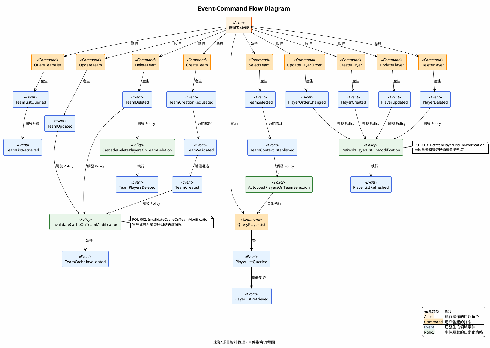
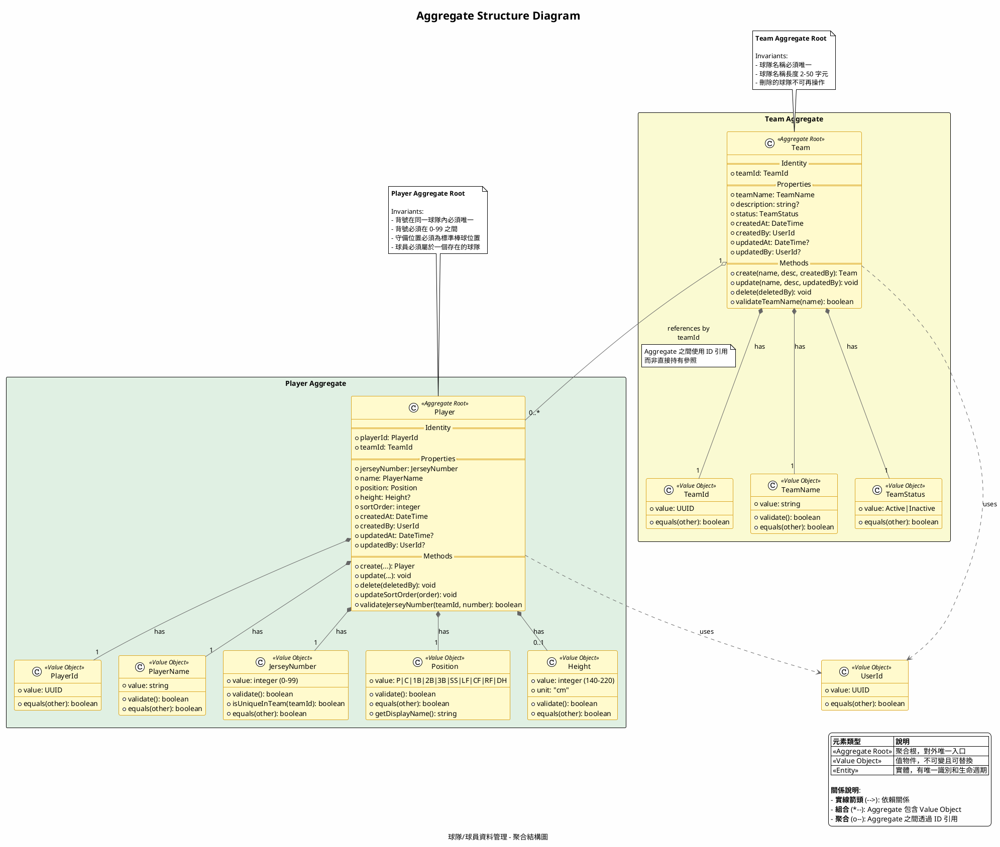

# PlantUML 圖表預覽

> 按 `Cmd+K V` 或右鍵選擇「Markdown Preview Enhanced: Open Preview to the Side」來預覽

---

## 01. Event-Command Flow（事件指令流程圖）

---

## 02. Aggregate Structure（聚合結構圖）

---

## 03. Business Flow（業務流程圖）

請參考：[03-business-flow.puml](03-business-flow.puml)

---

## 04. State Diagram（狀態轉換圖）

請參考：[04-state-diagram.puml](04-state-diagram.puml)

---

## 05. Mapping Matrix（對應矩陣圖）

請參考：[05-mapping-matrix.puml](05-mapping-matrix.puml)

---

## 使用說明

### 開啟預覽
1. **方式 1**：按 `Cmd+K V`（先按 Cmd+K，放開後按 V）
2. **方式 2**：右鍵點擊檔案 → 「Markdown Preview Enhanced: Open Preview to the Side」
3. **方式 3**：按 `Cmd+Shift+P` → 輸入「Markdown Preview Enhanced」→ 選擇「Open Preview to the Side」

### 匯出圖片
在預覽視窗中：
1. 右鍵點擊圖表
2. 選擇「Save as PNG」或「Copy as PNG」

### 如果圖表無法顯示
確保在 Markdown Preview Enhanced 設定中啟用了線上 PlantUML 服務：
1. 按 `Cmd+,` 開啟設定
2. 搜尋「Markdown Preview Enhanced」
3. 找到「PlantUML Server」設定
4. 確認使用線上服務（預設應該已啟用）
